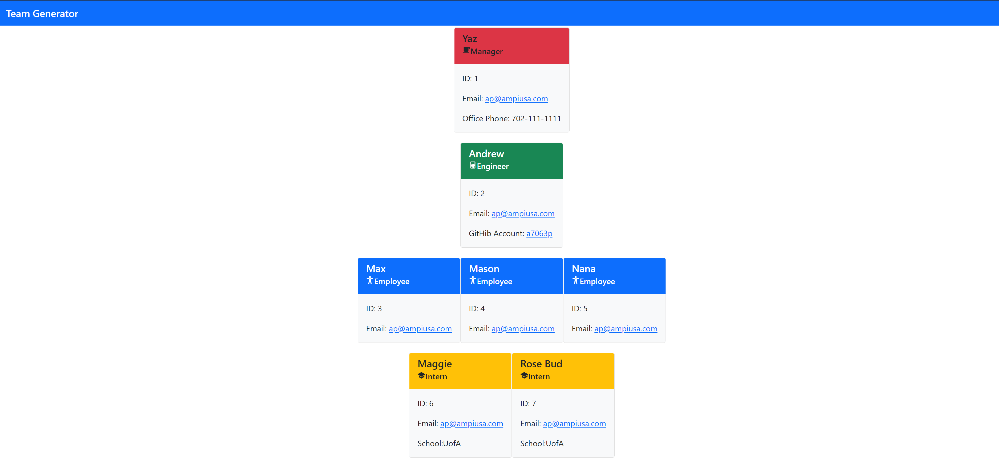

  # Team Generator
  

  ## Description
  This project is a Team Generator. Utilizing NPM Package Inquirer, the user is prompted to enter in employee information for members of a team, Thsi information includes Name, contact info, the employees current position within the company. Once answering all prompts and organzational chart is dynamically created utilizing HTML to view in the users browser.

  ## Table of Contents
  * [Installation](##Installation)
  * [Usage](##Usage)
  * [License](##License)
  * [Languages](##Languages)  
  
  * [Tests](##Tests)
  * [Questions](##Questions) 
  

  ## Installation
  This application requires, NPM Inquirer and Node to be installed.

  ## Usage
  Once the required packages are installed utilize the command prompt and enter node index.js to start the application 

    
  
  ## Languages  
              
 

  ## License
  
  
  This application currently is licensed with [MIT](./license/MIT.txt). 
  Please click on the [link](./license/MIT.txt) to review all terms, definitions and conditions of use.

  

  ## Contribute
  Thsi application is open to all users wishing to positively contribute to this project

  ## Tests
  Included are links to video demonstartions of this application

  ## Questions
  Please feel free to email me with any comments, questions or concerns at ap@ampiusa.com

  [GitHub Account](https://github.com/a7063p)
